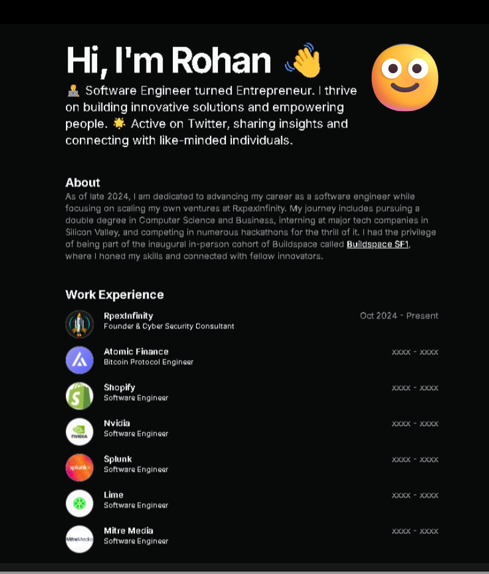

  


---

# Rohan Naagar's Portfolio

Welcome to my personal portfolio! 🚀  
This website showcases my professional skills, achievements, and projects in the fields of **Cybersecurity**, **IT Management**, and **Software Development**. You can explore the various sections to get a deeper understanding of my background, certifications, and the work I've done over the years.  

## Features:
- **About Me**: Get to know me, my values, and my professional goals.  
- **Projects**: A collection of my major projects, including Cyber Threat Detection, School Management System, Identity Detection Tool, and more.  
- **Certifications**: Learn about my industry certifications like CEH, CISSP, AWS Solutions Architect, and more.  
- **Contact**: Find ways to reach out to me for collaborations or consultations.

## Technologies Used:
- HTML, CSS, JavaScript
- React (for dynamic UI)
- Python (for backend and data analysis)
- Git & GitHub (for version control)
- Docker, Kubernetes (for containerization)

## Setup and Installation:
To view the portfolio locally:
1. Clone the repository:
   ```bash
   git clone https://github.com/RohanCyberOps/portfolio.git
   ```
2. Navigate to the project directory:
   ```bash
   cd portfolio
   ```
3. Open the `index.html` file in a browser or use a local server for dynamic content.

## License:
This project is licensed under the MIT License - see the [LICENSE](LICENSE) file for details.

---
